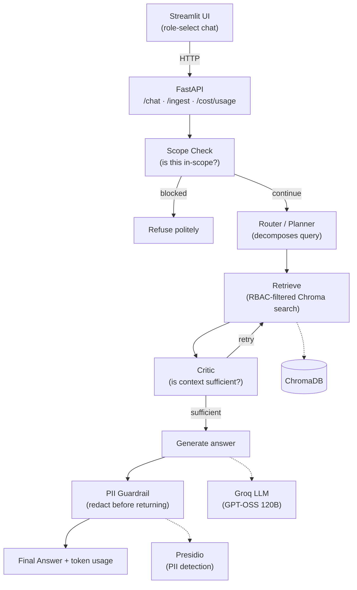

# Agentic RAG Chatbot with RBAC, Guardrails & Eval-Gated Deployment

An internal chatbot that answers questions from private company data — but actually respects who's asking.

Most "RAG chatbot" projects stop at retrieval + generation. This one doesn't, because in a real company that's not enough. If your vector index has payroll, financial reports, and marketing spend all mixed together, anyone with access to the bot can ask "what's the CFO's salary?" and get an answer — not because they're authorized, but because the document happened to be relevant. That's the gap this project closes.

[](https://www.python.org/)
[](https://fastapi.tiangolo.com/)
[](https://langchain-ai.github.io/langgraph/)


---

## What it does

- Answers questions from private company documents using RAG
- Enforces access control **at retrieval time** — Finance can't see payroll data, HR can't see financial reports, C-level sees everything, and the LLM never even gets restricted context in the first place
- Uses an agentic layer (LangGraph) to decompose multi-part questions and self-correct when retrieval comes back thin
- Redacts PII and refuses out-of-scope questions instead of guessing
- Runs an eval suite on every push (RBAC regression checks + Ragas quality scoring) so a bad change is caught before it ships
- Tracks token usage and cost per request

## Who this is for

| Role | Can see |
|---|---|
| Finance | Financial reports, marketing expense data |
| HR | Employee records, payroll |
| C-level | All of the above |
| Everyone else | General company docs only |

## Architecture



**Key design decision:** RBAC lives in the **retriever**, not the prompt. Every chunk gets a `role` tag at ingestion; the retriever filters on that tag before anything reaches the LLM. Restricted content is never in the model's context window to begin with — a stronger guarantee than "please don't share this."

## Tech Stack

| Layer | Tool | Notes |
|---|---|---|
| Backend | FastAPI | Typed, async |
| Orchestration | LangChain + LangGraph | LCEL base chain, LangGraph agent loop |
| LLM | Groq — `openai/gpt-oss-120b` | Migrated off `llama-3.3-70b-versatile` after Groq's Aug 2026 deprecation |
| Eval judge LLM | Groq — `openai/gpt-oss-20b` | Separate model + separate daily token quota, so eval runs don't starve the app's own quota |
| Vector store | ChromaDB | Embedded, role-metadata filtering at query time |
| Embeddings | `fastembed` (`BAAI/bge-small-en-v1.5`) | ONNX-based, no PyTorch — switched from `sentence-transformers` to cut memory footprint for free-tier hosting |
| Guardrails | Presidio (`en_core_web_sm`) + LLM scope classifier | PII redaction + out-of-scope refusal |
| Eval | Ragas (faithfulness, answer relevancy) | Behavioral checks (RBAC leak detection, refusal correctness) layered on top |
| Monitoring | Custom token/cost tracker | LangChain callback capturing usage per request |
| CI | GitHub Actions | Eval suite runs on every push to `main` |
| Frontend | Streamlit | Role-select chat UI, calls the FastAPI backend over HTTP |

| Deploy | Render (Docker) | See Phase 6 for the full story, including known limitations |

## Repo Structure

| Folder | Purpose |
|---|---|
| `ingestion/` | Chunking, embedding, upsert to Chroma |
| `rbac/` | Role definitions, access filter logic |
| `guardrails/` | PII redaction, out-of-scope classifier |
| `rag/` | Retriever, prompts, base LCEL chain |
| `agents/` | LangGraph router + retrieval-critic nodes |
| `app/` | FastAPI backend + Streamlit frontend |
| `evals/` | Ragas test set + eval runner |
| `monitoring/` | Token/cost tracker |
| `data/` | Synthetic role-tagged dataset (18 docs) |
| `.github/workflows/` | CI eval pipeline |

## Dataset

18 synthetic company documents, each tagged with a `role` in YAML frontmatter: 5 finance, 5 HR (including one with realistic fake PII for guardrail testing), 5 general, 3 cross-role "mixed" docs used to test the router's query decomposition.

## Getting Started

```bash
git clone https://github.com/Sukesh-blip/RAG-with-RBAC-Guardrails-and-Evals.git
cd RAG-with-RBAC-Guardrails-and-Evals

python -m venv venv
source venv/bin/activate        # Windows: venv\Scripts\activate

pip install -r requirements.txt
python -m spacy download en_core_web_sm

cp .env.example .env            # add your GROQ_API_KEY
```

Run:
```bash
uvicorn app.main:app --reload
```

Open `http://127.0.0.1:8000/docs` for the interactive API. Call `POST /ingest` once, then `POST /chat` with `{"role": "...", "query": "..."}`.

---

## Build Log — Phase by Phase

### Phase 0 — Scaffold + Dataset
Repo structure, 18-document synthetic dataset with role metadata, `requirements.txt`, environment setup. Established the open-source stack decision early: LangChain/LangGraph, ChromaDB, Groq, Ragas — deliberately avoiding Azure/OpenAI to keep the project runnable at zero cost.

### Phase 1 — Core RAG + RBAC
Built the ingestion pipeline (chunk → embed → upsert with role metadata) and a retriever that filters on role **before** anything reaches the LLM. Wired into a real FastAPI `/chat` endpoint.

**Verified:** Finance correctly answers finance questions; Finance is correctly refused when asking an HR/payroll question; HR and C-level get correct, role-appropriate access. Fixed an early bug where repeated `/ingest` calls silently duplicated chunks in Chroma and skewed retrieval — `/ingest` was made idempotent (clears the collection before re-adding).

### Phase 2 — Guardrails
Added two independent protections:
- **PII redaction** (Presidio) — strips phone numbers, emails, and financial identifiers from the final answer, even when the underlying document is one the role is authorized to see. Authorization to view a document isn't the same as raw contact/financial identifiers belonging in a chat response.
- **Out-of-scope detection** — an LLM classifier runs before retrieval, so the bot declines general-knowledge questions instead of hallucinating.

**Verified:** phone/email correctly redacted in an authorized HR query; out-of-scope questions correctly refused with zero wasted retrieval calls.

### Phase 3 — Agentic Layer
Replaced the single-pass chain with a LangGraph state machine: a **Router/Planner** node decomposes compound questions into sub-queries, and a **Retrieval-Critic** node judges whether retrieved context is sufficient, triggering a reformulated retry if not.

**Verified:** a compound cross-role question ("total FY2027 compensation budget and how many employees eligible for merit increases") was correctly split into two sub-queries, each retrieving from the right document, both facts answered correctly. This is the core proof that the system plans before answering rather than doing one blended search.

**Mid-phase incident:** Groq deprecated `llama-3.3-70b-versatile` (Aug 16, 2026 cutoff). Migrated to `openai/gpt-oss-120b` — a single `.env` change, since the model name was never hardcoded, by design.

### Phase 4 — Eval Suite + CI
Built an 18-item test set spanning finance/HR/general factual questions, cross-role compound questions, out-of-scope refusals, RBAC-adversarial attempts, and PII checks. The eval runner does two things: hard pass/fail behavioral checks (did RBAC actually block unauthorized content, not just "was anything retrieved") and Ragas quality scoring (faithfulness, answer relevancy).

**Debugging along the way:**
- An early version of the RBAC regression check was too blunt — it flagged *any* retrieval on an adversarial query as a leak, when the real check should be *did the retrieved content carry an unauthorized role tag*. Fixed by returning role metadata alongside retrieved text and checking against the role's actual allowlist.
- Hit Groq's per-minute and then per-day token rate limits while iterating (GPT-OSS 120B is a reasoning model — every judgment call burns hidden reasoning tokens). Fixed by giving the Ragas *judge* its own model (`openai/gpt-oss-20b`) via a separate `RAGAS_MODEL` env var — this both reduces per-call cost and moves the eval workload into a completely separate daily quota pool from the app's own model.

Wired into GitHub Actions (`.github/workflows/eval.yml`) — runs on every push to `main`. First CI run failed because `evals/run_eval.py` and `test_set.json` had been edited locally but never actually committed; fixed and re-pushed. **Demo:** deliberately broke the RBAC config on a throwaway branch (gave `finance` access to `hr` docs) and confirmed CI caught it by name in the failure log.

**Final verified run:** all behavioral checks passed, faithfulness 0.96, answer relevancy 0.95.

### Phase 5 — Cost Monitoring
Built a `TokenUsageCallback` that attaches to every LLM call within a single request (scope check, router, critic, generate) and accumulates usage. Added per-request and daily cost alert thresholds, a persistent JSONL usage log, and a `GET /cost/usage` endpoint.

**Verified:** a real `/chat` call correctly reported 6 LLM calls, real token counts, and an accurate cost estimate (~$0.0005/request); `/cost/usage` correctly accumulated across multiple requests.

### Phase 6 — Deployment
Built `app/streamlit_app.py` (role selector, chat UI, calls the FastAPI backend over HTTP) and a `Dockerfile` for the backend.

**This phase surfaced real free-tier infrastructure constraints, documented honestly rather than papered over:**

1. **Render OOM crash on deploy.** `sentence-transformers` pulls in the full PyTorch library (~300-400MB just to import), which alone exceeded Render's 512MB free-tier RAM limit. Fixed by switching to `fastembed` (ONNX-based, no PyTorch) and switching Presidio's spaCy model from `en_core_web_lg` to the much lighter `en_core_web_sm`.
2. **A genuinely missing `Dockerfile`.** During iteration, a stray `.Dockerfile` (with a leading dot) got created by a Notepad save quirk, while the actual `Dockerfile` Render needs was empty/missing. Root-caused via Render's build logs (`transferring dockerfile: 2B` — an empty file) and fixed by writing the file directly via PowerShell heredoc to avoid the editor's save-dialog behavior.
3. **Port-bind timeout.** The embedding model was being instantiated at module import time, meaning the app couldn't bind its port until the model finished loading — Render's port-scan gave up waiting. Fixed by lazy-loading the embeddings singleton on first actual use instead of at import.
4. **CPU starvation on Render's free tier.** Even after the memory fix, the service intermittently crash-looped. Log analysis showed the pattern precisely: Render's health-check ping (`GET /` every 5s) would stop entirely the moment ONNX Runtime began initializing its inference session, then the container would be force-restarted after ~50 seconds of silence. Render's free tier allocates 0.1 vCPU — a tenth of a core — which is thin enough that CPU-bound model initialization can starve the health-check thread itself, not just slow down user requests. This is a genuine infrastructure ceiling, not an application bug.
5. **Fly.io evaluated as an alternative** (real shared vCPU vs. Render's fractional slice) but requires a payment method on file even for free-tier-eligible usage, which conflicts with this project's deliberate zero-cost, zero-card design goal. Decision: stay on Render and document the limitation rather than take on card-based risk for a portfolio demo.

**Current status:** backend deploys successfully to Render and serves `/` and `/docs` reliably; `/chat` and `/ingest` (both of which trigger the embedding model) are intermittently affected by the CPU-starvation restart cycle described above. This is being tracked as a known, understood limitation of the free-tier hosting choice, not an unresolved application defect — the root cause is fully diagnosed.

### Phase 7 — Not yet started
Final README polish beyond this build log, plus recorded/screenshotted proof moments for each phase's checkpoint (RBAC block, PII redaction, agentic decomposition, CI catching a regression).

---

## Known Limitations

- **Render free-tier CPU starvation**: see Phase 6 above. A paid Starter instance (0.5 vCPU) or a platform with a full shared vCPU (e.g. Fly.io, which requires a card) resolves this; the current deploy accepts intermittent restarts as a tradeoff for staying genuinely free and card-free.
- **Ragas self-evaluation**: GPT-OSS models scoring their own outputs (even via a separate smaller model) tend to score generously — a known limitation of self-evaluation, not specific to this project.
- **Cold starts**: Render's free tier spins down after ~15 minutes idle; first request after idle can take 20-60+ seconds.


---

Built by [Sukesh Biradar](https://github.com/Sukesh-blip)
