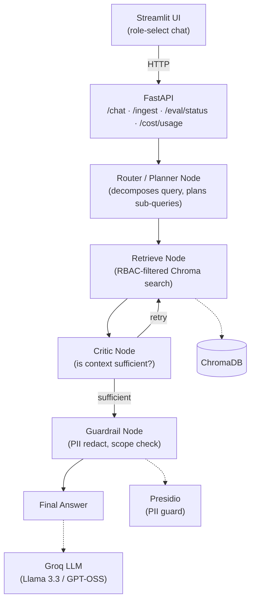

# Agentic RAG Chatbot with RBAC, Guardrails & Eval-Gated Deployment

An internal chatbot that answers questions from company data — but actually respects who's asking.

Most "RAG chatbot" projects stop at retrieval + generation. This one doesn't, because in a real company that's not enough. If your vector index has payroll, financial reports, and marketing spend all mixed together, anyone with access to the bot can ask "what's the CFO's salary?" and get an answer — not because they're authorized, but because the document happened to be relevant. That's the gap this project is built to close.

[](https://www.python.org/)
[](https://fastapi.tiangolo.com/)
[](https://langchain-ai.github.io/langgraph/)

---

## What it does

- Answers questions from private company documents using RAG
- Enforces access control **at retrieval time** — Finance can't see payroll data, HR can't see financial reports, C-level sees everything, and the LLM never even gets the restricted context in the first place
- Uses an agentic layer (LangGraph) to decompose multi-part questions and self-correct when retrieval comes back thin, instead of just doing one blind retrieve-and-answer pass
- Redacts PII and refuses out-of-scope questions instead of guessing
- Runs an eval suite on every push so a bad change gets caught before it ships
- Tracks token usage so cost isn't a surprise

Everything runs on free-tier, open-source tooling. No Azure, no OpenAI, no bill at the end of the month.

## Who this is for

| Role | Can see |
|---|---|
| Finance | Financial reports, marketing expense data |
| HR | Employee records, payroll |
| C-level | All of the above |
| Everyone else | General company docs only |

## Architecture



The design choice that matters most here: RBAC lives in the **retriever**, not the prompt. Every chunk gets a `role` tag when it's ingested into Chroma, and the retriever filters on that tag before anything reaches the LLM. That means there's no restricted content for the model to accidentally leak — it's simply never in its context window to begin with. That's a meaningfully different (and stronger) guarantee than telling the model "please don't share this."

## Stack

| Layer | Tool | Why this one |
|---|---|---|
| Backend | FastAPI | Typed, async, and it's how a real internal tool would actually be built |
| Orchestration | LangChain + LangGraph | LCEL for the base chain, LangGraph for the router/critic agent loop |
| LLM | Groq (Llama 3.3 70B) | Free, fast, no vendor lock-in |
| Vector store | ChromaDB | Embedded, zero infra, filters on metadata at query time |
| Embeddings | sentence-transformers | Runs locally, no embedding API cost |
| Guardrails | Presidio + a scope classifier | PII detection/redaction, and refuses questions outside the knowledge base |
| Eval | Ragas | Faithfulness, answer relevancy, context precision |
| Monitoring | LangSmith | Trace every agent run |
| CI | GitHub Actions | Runs the eval suite on every push |
| Frontend | Streamlit | Role-select chat UI |
| Deploy | Render + Streamlit Community Cloud | Free indefinitely, no surprise bill when a trial period ends |


## Dataset

18 synthetic company documents, each tagged with a `role` in its YAML frontmatter so the ingestion pipeline knows who's allowed to see it.

| Folder | Docs | What's in there |
|---|---|---|
| `data/finance/` | 5 | Financial reports, marketing expenses, budget forecast, vendor invoices, revenue breakdown |
| `data/hr/` | 5 | Payroll, leave policy, performance reviews, benefits, hiring policy |
| `data/general/` | 5 | Handbook, product roadmap, security policy, remote work, holiday calendar |
| `data/mixed/` | 3 | Docs that require both HR and Finance access — used to test whether the agent correctly decomposes cross-role questions |

## Getting started

```bash
git clone https://github.com/<your-username>/rag-rbac-chatbot.git
cd rag-rbac-chatbot

python -m venv venv
source venv/bin/activate        # Windows: venv\Scripts\activate

pip install -r requirements.txt
python -m spacy download en_core_web_lg

cp .env.example .env            # add your GROQ_API_KEY
```

Run the server:

```bash
uvicorn app.main:app --reload
```

Then open `http://127.0.0.1:8000/docs` — that's the interactive API, no separate client needed to test it.

## Using the API

**1. Ingest the documents (run once):**

POST /ingest


Chunks and embeds everything in `data/`, tagged with role metadata, into Chroma.

**2. Ask a question:**

POST /chat
Content-Type: application/json

{
"role": "finance",
"query": "What was Q3 revenue?"
}


Valid roles: `finance`, `hr`, `c_level`, `employee`

Response:

```json
{
  "answer": "...",
  "sources": [{"source": "q3_financial_report.md", "role": "finance"}],
  "retrieved_count": 4
}
```

### RBAC, actually verified

This isn't a diagram that only exists on paper — it's been run and tested across every role:

| Role | Question | What happened |
|---|---|---|
| finance | "What was Q3 revenue?" | Answered correctly from finance docs |
| finance | "What is Ananya Rao's salary?" | Refused — "I don't have access to that information" |
| hr | "What is Ananya Rao's salary?" | Answered correctly from HR docs |
| c_level | "What is Ananya Rao's salary?" | Answered correctly — full access confirmed |

The Finance-role refusal is the important one. It's not the model being polite — the payroll document was never retrieved in the first place, so there was nothing for it to leak even if you tried to jailbreak the prompt.

## Where it's at

- [x] **Phase 0** — repo scaffold, synthetic dataset
- [x] **Phase 1** — RAG + RBAC-filtered retrieval, wired into a real FastAPI `/chat` endpoint
- [ ] **Phase 2** — guardrails: PII redaction, out-of-scope detection
- [ ] **Phase 3** — agentic layer: LangGraph router + retrieval-critic
- [ ] **Phase 4** — eval suite + CI
- [ ] **Phase 5** — cost monitoring
- [ ] **Phase 6** — deploy (Render + Streamlit Cloud)
- [ ] **Phase 7** — demo polish


---

Built by [Sukesh Biradar](https://github.com/sukesh-blip)
